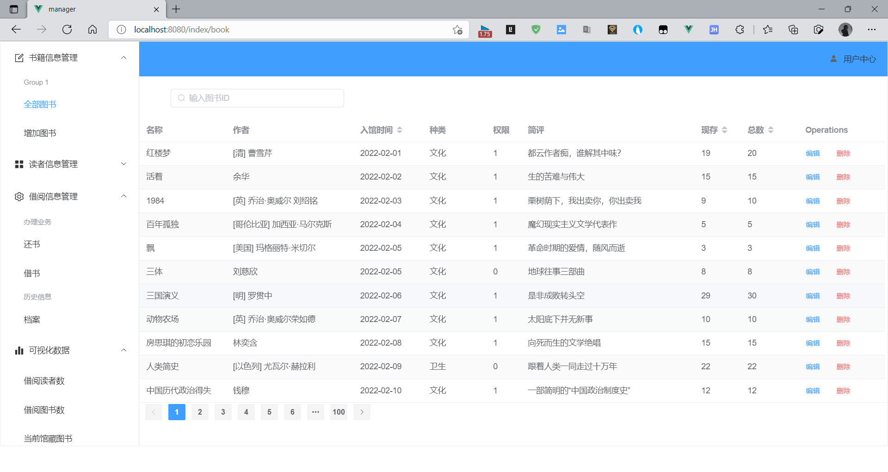

# book_manager

# 项目展示

### 注册与登录

支持校验，支持左右动画切换，参考b站up主[视频教程](https://www.bilibili.com/video/BV1PZ4y1G7bu?spm_id_from=333.999.0.0)，矢量图[来源](https://www.iconfont.cn/)

登录

注册

### 图书部分

### 读者部分

查看读者、增加读者 operation按钮还未添加功能

### 借阅信息部分

借书、还书、查看全部图书(支持按借出时间，当前借阅信息状态进行筛选)

# 1.项目使用技术栈

后端

- springboot
- mybatis-plus
- swagger

前端

- vue
- element-plus
- echarts

# 2.完成进度

2022年2月4日19:00:56

- 完成当前图书，读者功能接口
- 完成借阅信息service类,修改了主键Long的相关问题，修改了时间的相关问题

2022年2月5日09:56:15

- 增加借阅信息inf的controller
- 修改用户user的controller，敏感信息用post请求发送

2022年2月5日11:48:30

- 网络模块初步封装

2022年2月6日22:34:32

- 后端能成功接收到数据，注意请求参数在请求体中，接口接收到的参数应该加上@RequestBody，否则会出现为空的情况

2022年2月7日22:49:55

- 解决网络相关bug（修改后端代码，解决null的问题）
- 完善注册登录表单
- 实现登录功能

2022年2月9日21:25:21

- 实现基本功能

# 3.下一步任务

1. ~~去掉vue中无用的注释，提高可读性~~
2. ~~熟悉vue3基础语法，进行网络请求并保存数据~~
3. vuex使用
4. ~~注册与登录功能联调~~
5. ~~根据接口更新表单样式及内容~~
6. ~~基础功能全部实现~~
7. http的请求按照restful 规范做修改，比如更新资源需要用put
8. ~~编写图表功能相关接口~~
8. 完善功能
9. 增加图表功能
10. 完善动画效果
11. 后端代码进一步封装，优化

# 4.未来计划

1. 集成spring security和jwt实现权限功能
2. 集成Redis等实现验证码功能
3. linux部署
4. spring cloud
5. Nginx ...
