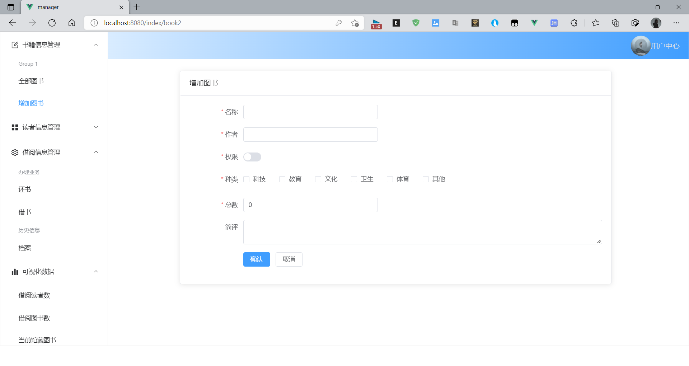

# book_manager

学习目的基本达到, 已弃坑, 数据库表已添加 如有疑问欢迎联系

# 项目展示

### 注册与登录

支持校验，支持左右动画切换，参考b站up主[视频教程](https://www.bilibili.com/video/BV1PZ4y1G7bu?spm_id_from=333.999.0.0)，矢量图[来源](https://www.iconfont.cn/)

登录

注册

### 图书部分

查看全部图书、点击右侧按钮对某一本书进行编辑（弹窗），删除、增加图书

### 读者部分

查看读者、增加读者 operation按钮还未添加功能

2022年2月12日增加渐变，上传头像，查看个人信息功能，头像参考上面的图片

### 借阅信息部分

借书、还书、查看全部图书(支持按借出时间，当前借阅信息状态进行筛选)

# 1.项目使用技术栈

后端

- springboot
- mybatis-plus
- swagger

前端

- vue
- element-plus
- echarts

# 2.完成进度

2022年2月4日19:00:56

- 完成当前图书，读者功能接口
- 完成借阅信息service类,修改了主键Long的相关问题，修改了时间的相关问题

2022年2月5日09:56:15

- 增加借阅信息inf的controller
- 修改用户user的controller，敏感信息用post请求发送

2022年2月5日11:48:30

- 网络模块初步封装

2022年2月6日22:34:32

- 后端能成功接收到数据，注意请求参数在请求体中，接口接收到的参数应该加上@RequestBody，否则会出现为空的情况

2022年2月7日22:49:55

- 解决网络相关bug（修改后端代码，解决null的问题）
- 完善注册登录表单
- 实现登录功能

2022年2月9日21:25:21

- 实现基本功能

2022年2月10日17:22:09

- 任务9的1
- 前端统一封装了图书的校验规则，到了utils文件夹下的bookRule
- 增加了数据

2022年2月12日18:56:22

- 增加文件上传功能，可以上传头像
- 主界面添加渐变效果

2022年3月17日16:15:19

- 查看全部图书添加了分页功能,但是请求图书总数的接口未写...如有需要自行补充

